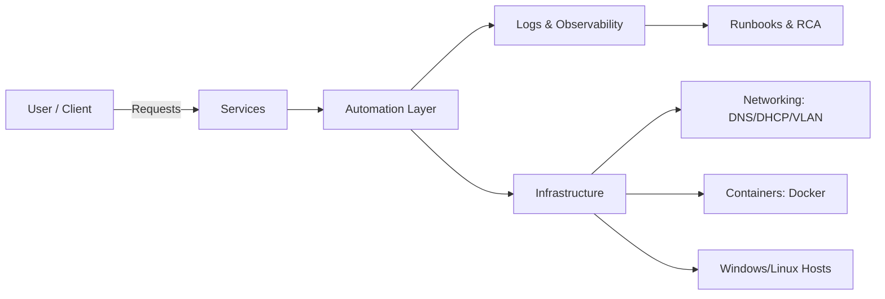

<!--
  Profile README for: Eric-Lebedenko
  Brand: Eric L. Morgan (ericlmorgan.com)
  Theme: Mission Control / Ops KB (Bottomless)
  Notes:
  - Put this file into a repo named exactly: Eric-Lebedenko
  - GitHub will render it on your profile automatically
-->

  

  

  
  
  

  
  
  
  
  

---

# Mission
Aspiring **Fachinformatiker – Systemintegration** focused on **practical IT**, **automation**, and **reliable system design**.

> “Strategy without execution is hallucination.”

---

# Navigation (scroll-friendly)
- [Now](#now)
- [Ops Dashboard](#ops-dashboard)
- [System Map](#system-map)
- [Tech Stack](#tech-stack-practical)
- [Projects](#projects)
- [Operational Systems](#operational-systems)
- [Runbooks & Playbooks](#runbooks--playbooks)
- [Incident Museum](#incident-museum)
- [Homelab](#homelab)
- [Security Posture](#security-posture)
- [Learning Matrix](#learning-matrix)
- [Cheatsheets](#cheatsheets)
- [Contact](#contact)

---

## Now
**What I’m doing currently**
- Preparing for Ausbildung (Systemintegration)
- Building small infra-related projects
- Practicing Linux/Windows administration, networking basics, Docker
- Writing automation scripts (repeatable, idempotent, documented)

**What I’m looking for**
- Ausbildung / internship opportunities where I can contribute with: documentation, automation, troubleshooting, clean ops.

---

## Ops Dashboard
### Core focus areas
| Domain | Capabilities | Status |
|---|---|---|
| Linux Admin | users/permissions, services, logs, troubleshooting | L → A |
| Windows Admin | basics, services, troubleshooting, fundamentals | L |
| Networking | TCP/IP, DNS, DHCP, VLAN basics, diagnostics | L → A |
| Containers | Docker fundamentals, compose patterns | L |
| Automation | scripting, CLI tooling, repeatable tasks, mini-pipelines | A |
| Security | least privilege, updates, secrets hygiene, baseline checks | L |

### Operating principles (I actually use)
- **Automate the second time**: if done twice → script it.
- **Make it observable**: logs first; then opinions.
- **Safe defaults**: least privilege, explicit configs, secrets discipline.
- **Docs are production**: runbooks are part of the deliverable.

---

## System Map

---

## Tech Stack (practical)
**Languages:** Python · C++ · C# · JavaScript  
**Web/Markup:** HTML5 · CSS3  
**Tools:** Git/GitHub · Linux (basic) · Docker (learning) · SQL (basic)  
**Concepts:** system integration · automation · scripting · infrastructure basics

  

---

## Projects
| Project | Why it exists | Stack |
|---|---|---|
| **[Telegram-bot-DVAG](https://github.com/Eric-Lebedenko/Telegram-bot-DVAG)** | automated partner/client sourcing & intake, structured flows | Python, aiogram |
| **Finance Tools (private/soon)** | analytics toolkit (CAPM, factor views), API-first thinking | Python, Pandas, FastAPI |
| **Investment Calculator (soon)** | ROI & DCF web app for practical decision support | Python, Streamlit |

---

## Operational Systems
This is a “systems-first” section: even if projects are small, I document them like production.

  
<b>System catalog template (copy/paste)</b>

**System name:**  
**Purpose:**  
**Users:**  
**Interface:** CLI / Web / Bot / API  
**Runtime:** Linux / Windows / Docker  
**Data:** where stored, backup policy  
**Secrets:** how stored (never in repo)  
**Observability:** logs/metrics/alerts  
**SLO (training):** e.g. 99% weekly availability, RTO/RPO targets  
**Runbook:** link  
**Change log:** link/notes

  
<b>Example SLOs (training-grade but realistic)</b>

- **Availability:** 99.0% per week (allowed downtime ~1h 40m/week)
- **RTO:** 60 minutes (restore service within 1 hour)
- **RPO:** 24 hours (lose at most 1 day of data)
- **MTTR target:** under 30–60 minutes for common incidents

---

# Runbooks & Playbooks
Ниже — “бездна”: раскрывающиеся разделы, как внутренний wiki/KB.

  
<b>Runbook template (copy/paste)</b>

**Purpose**  
- What this system does, for whom, and what “healthy” looks like.

**Dependencies**  
- External services, credentials, ports, DNS entries.

**Start/Stop**  
- Start:
- Stop:
- Restart:

**Health Checks**  
- `systemctl status ...`
- `journalctl -u ... -n 200 --no-pager`
- Endpoint check:
- Disk/CPU/RAM checks:

**Common Incidents**  
- Symptom → likely cause → fix steps

**Rollback**  
- How to revert safely

**Owner**  
- Who maintains this and escalation path

  
<b>Incident report template (RCA)</b>

**Title:**  
**Severity:** SEV-1/2/3  
**Start:**  
**End:**  
**Impact:** Who/what was affected

**Timeline**
- T0:
- T+5:
- T+30:
- Resolution:

**Root Cause**
- Primary cause:
- Contributing factors:

**Corrective actions**
- Immediate fix:
- Preventative tasks (automation/monitoring/docs):

**Lessons learned**
- What worked:
- What failed:
- What to improve:

  
<b>Checklists (Ops)</b>

### Pre-change checklist
- [ ] Backup / snapshot exists
- [ ] Rollback steps written
- [ ] Maintenance window defined (if needed)
- [ ] Monitoring in place (at least logs)
- [ ] Risk assessed (blast radius)

### Post-change checklist
- [ ] Smoke tests passed
- [ ] Logs clean (no new errors)
- [ ] Metrics stable (CPU/RAM/disk/network)
- [ ] Documentation updated

  
<b>Automation catalog (what I like to automate)</b>

- provisioning: users, packages, configs
- service lifecycle: start/stop/restart/health checks
- log parsing + alerts
- backups + verification
- “one command” environment bootstrap

**Rule:** automation must be:
- idempotent (safe to run repeatedly)
- readable (future-me can debug it)
- logged (you can prove what happened)

  
<b>Diagnostics playbook (default workflow)</b>

1. **Confirm impact**: who/what is affected, scope, severity  
2. **Check health**: service status, ports, disk, memory, CPU  
3. **Check logs**: last 200 lines + correlate timestamps  
4. **Reproduce**: minimal reproduction steps (if possible)  
5. **Isolate layer**: network → host → container/service → app  
6. **Fix safely**: smallest reversible change  
7. **Verify**: smoke test + log sanity  
8. **Document**: incident note + prevention task

---

# Incident Museum
Failure stories (even in lab) are proof of real ops thinking.

  
<b>Example: Service won't start after config change</b>

**Symptoms:** `systemctl restart ...` fails, exit code non-zero  
**Hypothesis:** invalid config syntax or permission issue  
**Checks:**
- `systemctl status SERVICE --no-pager`
- `journalctl -u SERVICE -n 200 --no-pager`
- config lint / validation command (if available)

**Fix:**
- rollback config to last known good
- validate and re-apply change in small steps

**Prevention:**
- add config validation to script/CI
- keep a backup of config + timestamped change log

  
<b>Example: Docker container loses data after restart</b>

**Symptoms:** data disappears after redeploy  
**Root cause (typical):** no volume mounted (data stored in container FS)  
**Fix:** create named volume or bind mount  
**Prevention:** template Compose files with explicit volume mapping + backup job

---

# Homelab

  
<b>Homelab blueprint (concept)</b>

**Goal:** a repeatable mini-infrastructure that mimics real ops:
- DNS/DHCP simulation
- a couple of services (web/api/bot)
- logging + basic monitoring
- backups + restore tests
- documented runbooks

**Topology (example)**
- router / gateway
- one Linux host (services, docker)
- one Windows VM (admin practice)
- VLAN (optional): mgmt / services / client

  
<b>“Build log” format I use</b>

Each lab experiment gets:
- **Objective**
- **Steps**
- **Verification**
- **Issues encountered**
- **Fix**
- **Runbook snippet**
- **What I’d improve next time**

---

# Security Posture

  
<b>Baseline security habits</b>

- least privilege mindset (minimum permissions)
- updates & patch hygiene
- secrets never committed to git
- environment variables / secret stores (where possible)
- logging for accountability (audit mindset)

  
<b>Hardening checklist (starter)</b>

- [ ] disable unused services
- [ ] firewall rules explicit
- [ ] SSH keys preferred over passwords (where applicable)
- [ ] backups encrypted (where applicable)
- [ ] log rotation configured
- [ ] principle of least privilege applied

  
<b>Secrets discipline</b>

- `.env` files are gitignored
- credentials rotated when leaked
- prefer per-service tokens with minimal permissions
- store secrets in env vars or secret managers (when available)

---

# Learning Matrix

  
<b>Ausbildung prep roadmap (2026)</b>

- **Q1**: Linux fundamentals + subnetting + DNS essentials  
- **Q2**: Windows admin + DHCP/DNS labs + troubleshooting routine  
- **Q3**: Docker/Compose + monitoring basics + backups  
- **Q4**: a “production-like” infra project (docs + runbook + hardening checklist)

Deliverables that matter:
- clean README + diagrams
- scripts safe + idempotent
- “how to operate it” docs

  
<b>Skill proof strategy (how I demonstrate competence)</b>

For each skill:
- small project + README
- commands used + reasoning
- failure cases + fixes
- short runbook
- minimal demo video/gif (optional)

  
<b>Day-1 value (Ausbildung-ready contributions)</b>

Things I can reliably help with from day one:
- writing/cleaning documentation (runbooks, checklists, SOPs)
- automating repetitive tasks (scripts, wrappers, small tools)
- basic troubleshooting with a structured method
- log collection, reproduction steps, and concise incident notes
- Git hygiene: issues, PRs, changelogs, clear README

---

# Cheatsheets

  
<b>Networking essentials</b>

**DNS**
- A/AAAA: host → IPv4/IPv6  
- CNAME: alias → canonical name  
- MX: mail routing  
- TXT: verification / SPF / DKIM / misc notes  

**DHCP**
- leases, reservations, options (router/DNS), scope design

**VLAN**
- segmentation for security + blast radius reduction  
- typical split: mgmt / services / clients / guest

**Troubleshooting quick**
- `ip a`, `ip r`, `ping`, `traceroute`, `dig`, `nslookup`
- `ss -tulpn` (list listeners)

  
<b>Linux (systemd + logs)</b>

- service status: `systemctl status NAME --no-pager`
- restart: `sudo systemctl restart NAME`
- enable at boot: `sudo systemctl enable NAME`
- logs: `journalctl -u NAME -n 200 --no-pager`
- follow logs: `journalctl -u NAME -f`

  
<b>Docker essentials</b>

- running containers: `docker ps -a`
- logs: `docker logs --tail 200 -f CONTAINER`
- exec shell: `docker exec -it CONTAINER sh`
- volumes: `docker volume ls`
- compose: `docker compose up -d`, `docker compose logs -f`

---

# Contact
- Email: **erik.lebedenko.888@gmail.com**
- LinkedIn: https://linkedin.com/in/Eric-Lebedenko
- Website: https://ericlmorgan.com

---

© Ericlmorgan.com (Erik Lebedenko). All rights reserved.

  

